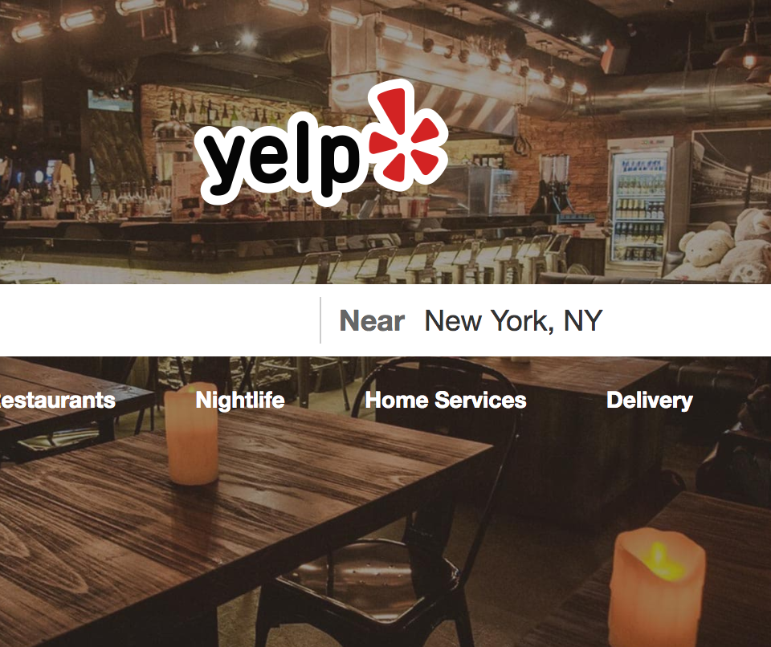

## Introduction

In this project, I aim to identify the key features for people in Phoneix to give score on Yelp. Using the Yelp Dataset, I compare the influence of every attributes in the dataset based on the category. In particular, I compare every attribute to the appearance of hipsters in order to find out whether the ambiance of hipsters will affect the average score of the store.

## Results
From the graph of category and total reviews, we can see that restauratn's Yelp strongly influences an individual's dining decisions. 

The Yelp Dataset comes from the Yelp Dataset Challenge webpage. Our project only focus on the Phoniex so we filltered out other countries and states. This left us with 10,629 businesses. I inner joined the business and review table so I have 10,629 observations and 116 variables. In order to directly find out the type of store has the most ambience of hispters, I also filtered out all non-restaurant business and build a subset dataset restaurant. 

From plotting, I find out that there are  some features that are the most important among all features： street parking, making reservation, review count, noise level, outdoor seating, classy ambience, hipster ambience, good for groups, good for kids, good for groups, allows smoking, and has TV. 

Hipsters are those people who walk around town as a beard-and-glasses with plaid shirts, listening to new-ish music and seeking status. For some reasons, many people hates hipsters. The Yelp data I have also take this into consideration when rating a store. I specifically do some plotting and try to find out whether the ambience of hipster will influence the rating of the store. It turns out that hipster independently would not affect the lower rating at all. However, one of the interesting thing is that hipster would normally show up in the food, bars, American restaurants. They seldom go to the Asian resturant except the fusion bars which is much similar with American style bars. Also, I find out hipsters are not the main source of the noise. So in my opinion, it is unreasonable to discriminate against them. 

## Future work
In the future, I plan to build a social network between all users and produce a small recommendation system.

