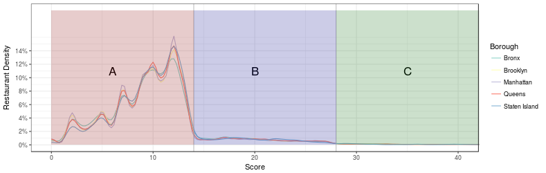
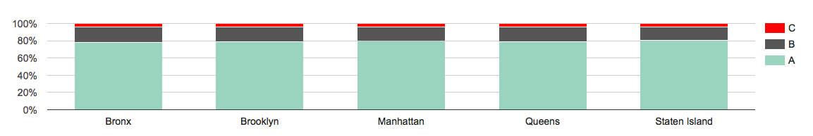
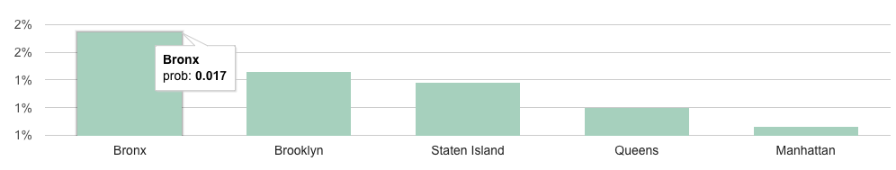
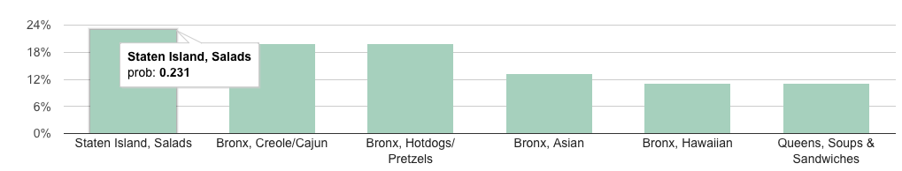
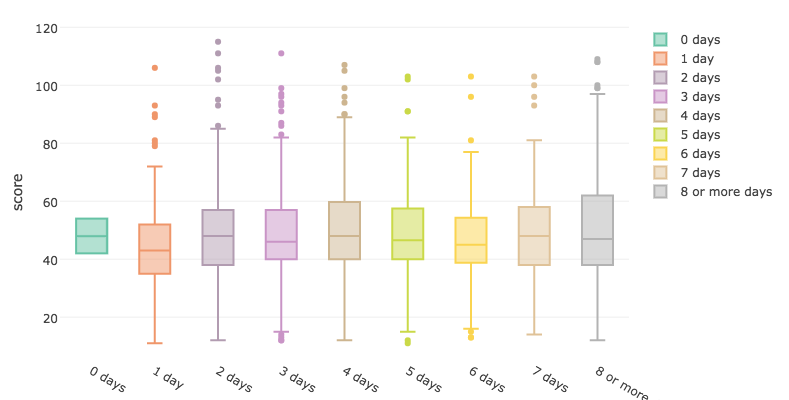
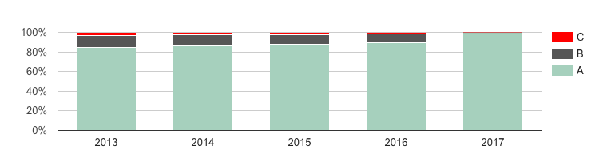
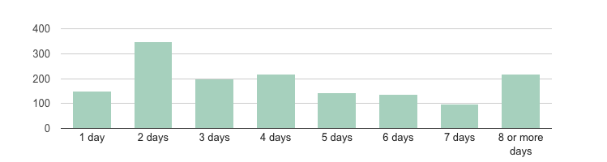
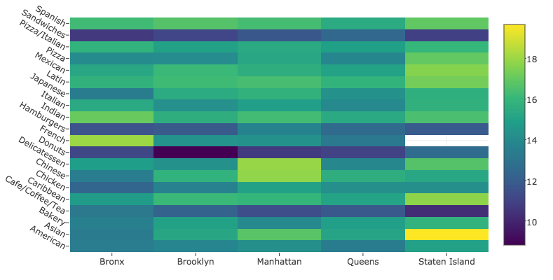
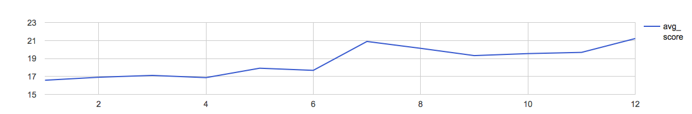

NYC Restaurant Health Inspections 
========================================================
author: Yvonne Lau
date: January 29, 2017
autosize: true

Introduction
========================================================
- Dataset: Restaurants Health inspections scores and grades(e.g A,B,C) in NYC
About 400,000 rows with data from about 25000 restaurants from 2012-2017

<b>Initial Questions:</b>
- Most restaurants seem to have As: is this observation confirmed by the data?
- Are restaurants in Manhattan "cleaner" than in other Boroughs?
- Is the length of a restaurant closure related to how high the inspection score is?
- To minize my chances of food poisoning, which type of restaurants(by either Borough or/ and Cuisine) should I avoid?

Density Plot of Scores 
========================================================

Distribution of Grades by Borough
========================================================

Proportion of closures by borough
========================================================

Proportion of closures by borough and cuisine (Top 5)
========================================================

Scores of Restaurants closed vs length of Closure
========================================================

Conclusions
========================================================
- Letters Grades don't convey much information since most restaurants at A level.Looking at scores provides a finer look at a restaurant's sanitary condition
- Manthattan restaurants have similar percetanges of A grades when compared to other Boroughs
- Against my initial thought, there is no clear relationship between length of closure and inspection score
- If I want to avoid restaurants with a history of harzadous health violations, I better stay clear from Salads in Staten Island and Cajun food in the Bronx
- All in all, dining out in NYC does not seem to impose any major health threats

Further Analysis
========================================================
- Variation of Score by temperatures/season
- Analyse if restaurants that closed tend to improve over time
- Investigate violation types and relate to other data (such as 311 requests)

Distribution of Grades
========================================================

Distribution of length of temporary closure due to sanitary violations
========================================================

Average Score of Restaurants by Cuisine and Borough
========================================================

Average Score of Restaurants by Month (in 2016)
========================================================

