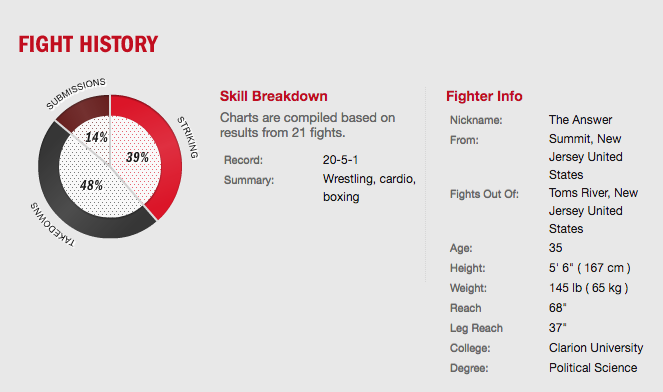
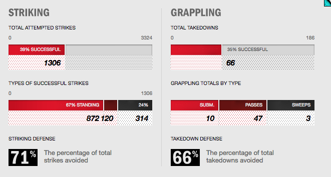
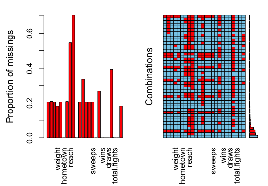
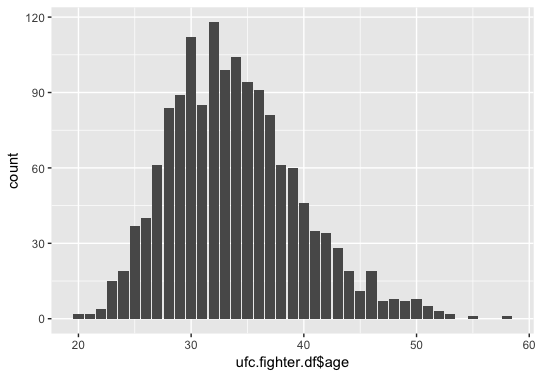
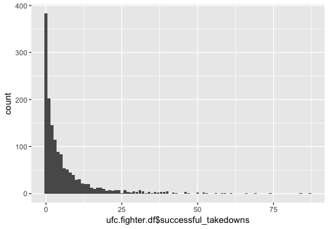
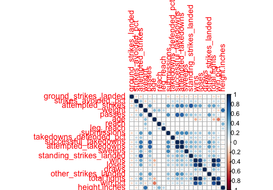
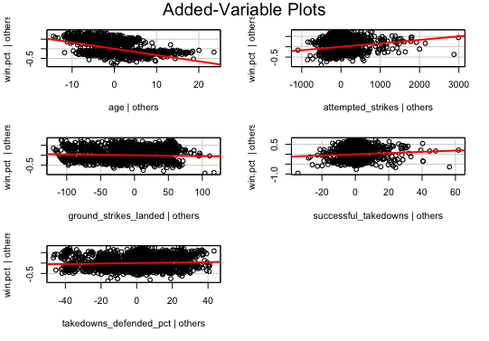

```{r setup, include=FALSE}
knitr::opts_chunk$set(echo = FALSE, warning = FALSE, message = FALSE)
```

## Introduction

The primary goal of this project was to aquire data detailing specific fighter attributes from the **Ultimate Fighting Championship** website <http://www.ufc.com> through the use of the **Scrapy** library for **Python** and use that data to try to determine if there is a certain relationship between those attributes and the quality of the fighter.

## Project Overview

- Data Aquisition
- Data Cleansing and Imputation
- Linear Regression Analysis
- Conclusions

## Data Aquisition

Fighters on the UFC website are listed as below:


## Data Aquisition

From the listing page, the **scrapy spider** crawls through each fighter link to display details on fighter attributes.


## Data Aquisition

Also included on the fighter's page are details on the fighter's specific striking and grappling numbers.




## Data Cleansing and Imputation
**Fields gathered through scrapy spider:**
- Fighter Name
- Fighters Home Town
- Location Fighting Out Of
- Age
- Fight Record
- Height
- Weight
- Reach
- Leg Reach
- Attempted Strikes
- Standing Strikes Landed
- Ground Strikes Landed
- Attempted Takedowns
- Successful Takedowns
- Submissions
- Sweeps
- Passes
- Percentage of Takedowns Defended
- Percentage of Strikes Avoided

**Fields created:**
- Wins
- Loses
- Draws
- Total Fights
- Win Percentage

## Data Cleansing and Imputation
After cleaning the data set, the missingness of the dataset was assessed.



This accounted for ~ 18.6% of observations and particularly impacted the "Reach" and "Leg Reach" fields.

## Data Cleansing and Imputation

The missing data was then imputed based on how the field was distributed - mean if complete cases were well distributed, median if outliers were a consideration, ect.




## Regression Analysis

How can we measure the quality of a fighter?

One obvious attribute to examine was the amount of wins a fighter has. The goal being to regress the numeric attributes of the fighter and try to model the win percentage of that fighter.

## Regression Analysis
First took a look a the correlation matrix


## Regression Analysis

By constructing a step-wise regression on the win percentage through the use of the AIC algorithm, I was able to yield attributes for modelling the win percentage.

Below are the added-variable plots for the resulting attributes:


## Conclusion

Given that the model produced an R-squared value of 0.31, it appears that fields used in the model do not necessarily give a "good" indication of fighters amount of wins as a percentage of total fights.