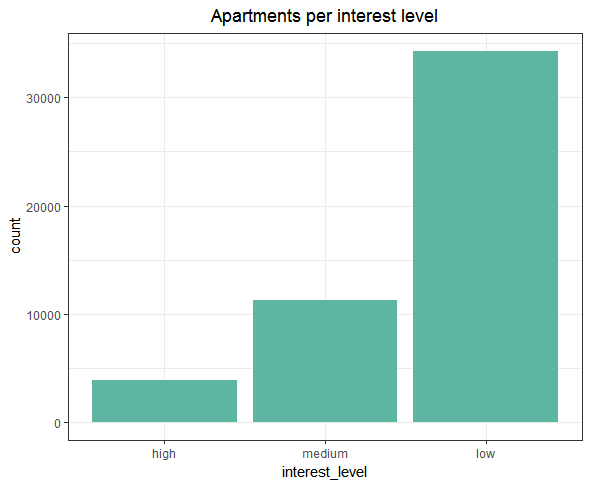
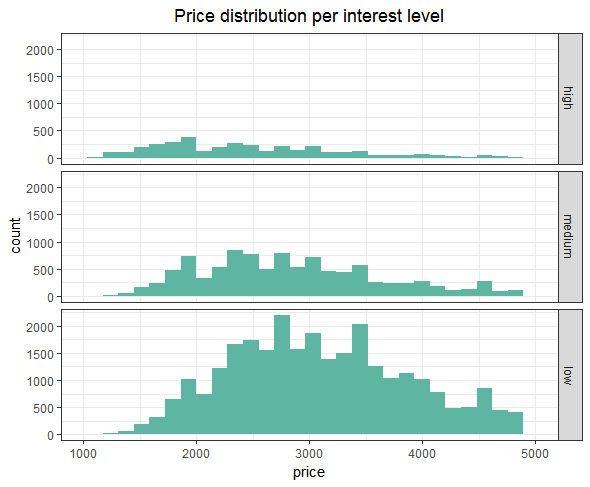
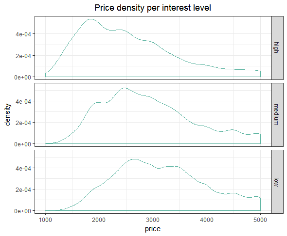
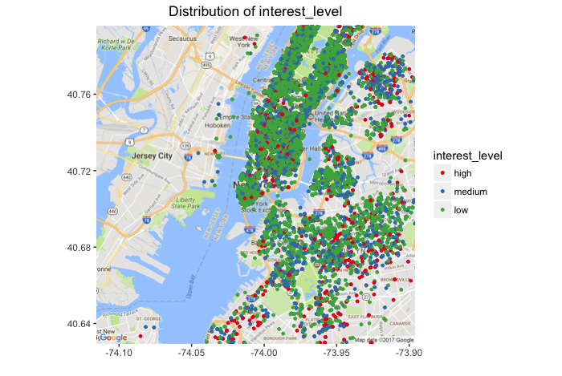
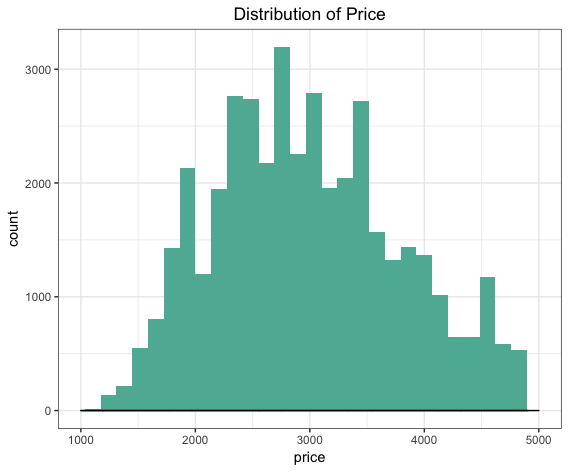
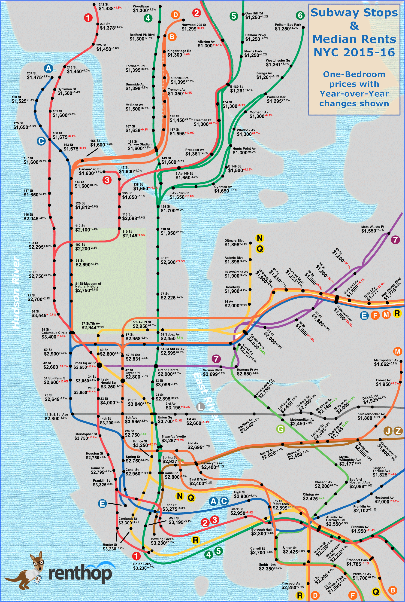
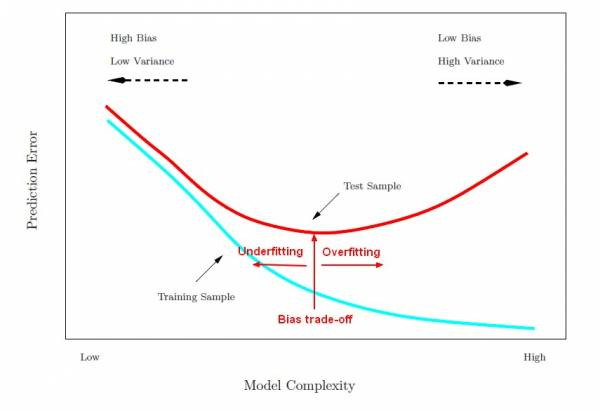

Machine Learning Kaggle Project
========================================================
author: Daniel Epstein, Jessie Gong, Stefan Heinz, Yvonne Lau, Ethan Weber
date:
autosize: true

Agenda
========================================================
1. Introduction
2. EDA
3. Feature Engineering
4. Model Selection
5. Model Tuning
6. Conclusion

========================================================
type: section
&nbsp;
&nbsp;
&nbsp;
# 1. INTRODUCTION

Introduction
========================================================

* Framework: [Two Sigma Connect: Rental Listing Inquiries](https://www.kaggle.com/c/two-sigma-connect-rental-listing-inquiries)
* Question: How much interest will a new rental listing on RentHop receive?
* Primary task: Employ machine learning techniques to accurately make predictions
given a dataset
* Goals:
  + Create a model that predicts well
  + Describe data insights drawn from exploration
* Datasets were provided as `json` files
  + training: 49,352 observations x 14 variables
  + test: 74,659 observations x 13 variables
* Optional: 78.5gb 7z file containing more than 700,000 JPGs

========================================================
type: section
&nbsp;
&nbsp;
&nbsp;
# 2. EDA

Basic EDA: Interest level
========================================================
* The training dataset was very imbalanced, meaning there were much more apartments
having a low `interest_level` than those having medium (3.1x) or high (8.9x).

Basic EDA: Price x Interest level
========================================================

* From histogram and density plot it can be seen that lower-priced apartments tend
to more frequently have an interest level of 'high' than higher-priced ones

|      |      |
|-----:|:-----|
|||

Basic EDA: Location
========================================================
* This map shows the distribution of apartments per interest level all over
New York City

========================================================
type: section
&nbsp;
&nbsp;
&nbsp;
# 3. FEATURE ENGINEERING

Feature Engineering: Price
========================================================

After some data cleaning:
* # of bedrooms ranges from 0 to 4
* # of bathrooms ranges 1 to 7

Feature Engineering: Price
========================================================
* Problem: In the rental market, price heavily influences level of interest. However a $2,500 1-br won't raise the same level of interest as a 3-br for the same price
* Solution: For a more 'apples-to-apples' comparison, `price/room` and `price/bed` features were created

Feature Engineering: Timestamps
========================================================
* Timestamp `created` in standard format `YYYY-MM-DD HH:MM:SS`
* `as.POSIXct()` to convert from `character` to actual `timestamp` for enabling
date/time arithmetics
* R library `lubridate` to create 10 variables derived from `created`, such as
  + Week
  + Weekday
  + Hour
  + ...
* Timestamps might not be in EST but rather PST, because Renthop is hosted in San Francisco

Feature Engineering: Location Clustering
========================================================
* Problem: Level of interest is also dependent on price with respect to location. A $2,000 1-br apartment should lead to a higher level of interest in Hell's Kitchen than in The Bronx. However, the original dataset only has lat/long information.

Feature Engineering: DBSCAN Clustering
========================================================
* Solution: Use a clustering algorithm to create neighborhoods.
  + Chosen method: DBSCAN
* DBSCAN:
  + Density based clustering algorithm
  + Given a set of points in some space, DBSCAN groups together points that are closely packed together (points with many nearby neighbors), and marks points as outliers if they lie alone in low-density regions.
  + Only two variables are needed: `eps` and `min_samples`
* Results: 2,487 neighborhoods created from this clustering method

Feature Engineering: Price & Location
========================================================
* Intuition: Given the average rental price for a neighborhood, level of interest on a listing is expected to be higher for listings whose price are below market average.
* Problem: Competition matters. Dataset did not come with any information on whether a listing's price was "above market" or "below market"
* Solution: To generate "above market", "below market" features, we used clusters from DBSCAN clustering to compute the following metrics:
  + `price difference`: difference between listing's price and neighborhood's average price
  + `price per room diffference` and `price per bedroom difference` were computed in a similar fashion.

Feature Engineering: Percentile Columns
========================================================
* Used library `dplyr` to group by training data by manager ID and building ID
* Counted number of listings per manager ID and building ID
* Sorted by these counts and created variables for Top 1%, Top 5%, Top 10%, and Top 25% for building ID and manager ID

Feature Engineering: Apartment features and photos
========================================================
* In the original data files obtained from kaggle - `train.json` and `test.json` - ,
two columns - `photos` and `features` - were acutally lists, i.e. contained
multiple values for each row
* We decided to omit both these columns from the overall apartment dataset
and created two separate files for them, consisting of:
  + aptID, feature
     - train: 267,906 rows
     - test: 404,920 rows
  + aptID, photo
     - train: 276,614 rows
     - test: 419,598 rows

Feature Engineering: Dummy Feature Columns
========================================================
* Picked 20 most common
* Gave either a 1 or a 0 depending on if that feature was present
* Allowed us to seperate features to see which are most predictive

Feature Engineering: Photos
========================================================
* Python script using libraries `PIL` to get basic information from 695,619
photos (excl. broken files)
  + Width, height in pixels
  + RGB values
  + Brightness (based on RGB values)
* Aggregating above values into single columns for each apartment observation,
i.e. grouping by `listing_id`
  + `avg()` and `median()` for
     - Width, height
     - Pixel ratio and size, difference of ratio from golden ratio (1.618034)
     - RGB values
* Images were clustered using k-means clustering

Feature Engineering: TFIDF
========================================================
* jessie

Feature Engineering: Sentiment Analysis
========================================================
* `description` column might be interesting, however format, content, ... differ
widely
* Sentiment analysis using R library `syuzhet` to get an idea how the description
might be perceived by users of the website
* This resulted in 8 new dummy variables conveying the strength of the following
emotions for each description:
  + anger, anticipation
  + disgust, fear
  + joy, sadness
  + surprise, trust
  + negative, positive
* These columns in our case contained values in the interval [0 .. 58], with higher
values indicating a stronger presence of a particular emotion

Feature Engineering: Putting it all together
========================================================
* Feature engineering was done by every member of the team
* Some of them used R while others explored options in Python
* This led to a fragemented codebase with various features being added from different
team members and sources over time
* R script to make sure that the final data frame we used - v17 - could
easily be reproduced:
  + Integrated all the various R code chunks and the results from the computations
  done in Python (`csv` files)
  + Create data frame, then RDS file based on input data - `train` or `test`
  + Create data frames, then RDS files for photos, features

========================================================
type: section
&nbsp;
&nbsp;
&nbsp;
# 4. MODEL SELECTION

========================================================
type: section
&nbsp;
&nbsp;
&nbsp;
# 5. MODEL TUNING

Model Tuning: XGBoost
========================================================
+ Decided against grid search,
+ Created google doc with parameters used and the resulting log loss
+ In general, found we were overfitting, tuned parameters to account for this

Tuning XGBoost: Eta
========================================================
+ Eta = learning Rate
+ Get weights after each boost step and shrinks them
+ Smaller values prevent overfitting
+ We got our best results with an 0.01 eta

Tuning XGBoost - Gamma
========================================================
+ Gamma = Controls regularization
+ Loss reduction required to make a partition on the leaf node
+ Larger values prevent overfitting
+ We got our best results with an 0.175 gamma
+ Tradeoff between bias and variance

Tuning XGBoost: Max Depth
========================================================
+ Max Depth = number of levels trees are allowed to grow
+ Trees that are allowed to grow to deep are generally overfitted
+ Keeping this number low can help prevent overfitting
+ We found 7 was the best value for us

Tuning XGBoost: Column Sample By Tree
========================================================
+ Number of columns randomly sampled by each tree
+ Not using 100% of the columns helps prevent overfitting
+ We found that 80% was the most effective value

Tuning XGBoost: Subsample
========================================================
+ Number of rows randomly sampled
+ Not using 100% of the rows helps to prevent overfitting
+ We found that 80% gave us the best validation and test accuracy
