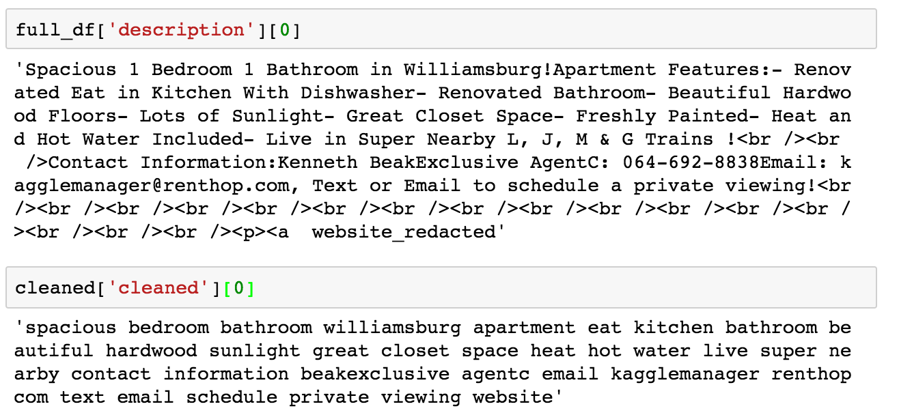
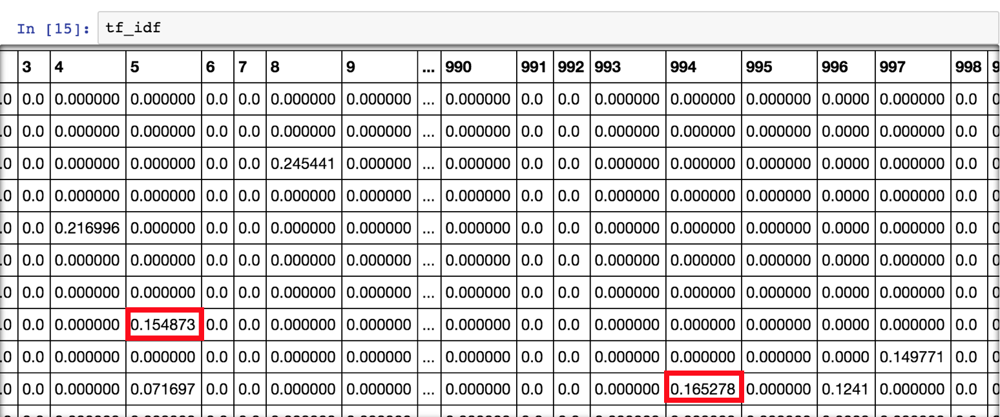
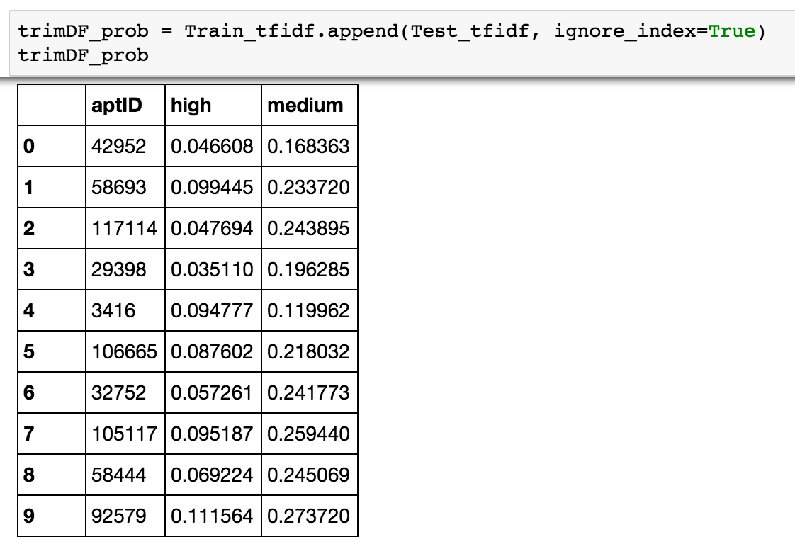

Machine Learning Kaggle Project
========================================================
author: Daniel Epstein, Jessie Gong, Stefan Heinz, Yvonne Lau, Ethan Weber
date:
autosize: true

Agenda
========================================================
1. Introduction
2. EDA
3. Feature Engineering
4. Model Selection
5. Model Tuning
6. Conclusion

========================================================
type: section
&nbsp;
&nbsp;
&nbsp;
# 1. INTRODUCTION

Introduction
========================================================

* Framework: [Two Sigma Connect: Rental Listing Inquiries](https://www.kaggle.com/c/two-sigma-connect-rental-listing-inquiries)
* Question: How much interest will a new rental listing on RentHop receive?
* Primary task: Employ machine learning techniques to accurately make predictions
given a dataset
* Goals:
  + Create a model that predicts well
  + Describe data insights drawn from exploration
* Datasets were provided as `json` files
  + training: 49,352 observations x 14 variables
  + test: 74,659 observations x 13 variables
* Optional: 78.5gb 7z file containing more than 700,000 JPGs

========================================================
type: section
&nbsp;
&nbsp;
&nbsp;
# 2. EDA

Basic EDA: Interest level
========================================================
* The training dataset was very imbalanced, meaning there were much more apartments
having a low `interest_level` than those having medium (3.1x) or high (8.9x).

Basic EDA: Price x Interest level
========================================================

* From histogram and density plot it can be seen that lower-priced apartments tend
to more frequently have an interest level of 'high' than higher-priced ones

|           |           |
|----------:|:----------|
|||

Basic EDA: Location
========================================================
* This map shows the distribution of apartments per interest level all over
New York City

========================================================
type: section
&nbsp;
&nbsp;
&nbsp;
# 3. FEATURE ENGINEERING

Feature Engineering: Price
========================================================

After some data cleaning:
* # of bedrooms ranges from 0 to 4
* # of bathrooms ranges 1 to 7

Feature Engineering: Price
========================================================
* Problem: In the rental market, price heavily influences level of interest. However a $2,500 1-br won't raise the same level of interest as a 3-br for the same price
* Solution: For a more 'apples-to-apples' comparison, `price/room` and `price/bed` features were created

Feature Engineering: Timestamps
========================================================
* Timestamp `created` in standard format `YYYY-MM-DD HH:MM:SS`
* `as.POSIXct()` to convert from `character` to actual `timestamp` for enabling
date/time arithmetics
* R library `lubridate` to create 10 variables derived from `created`, such as
  + Week
  + Weekday
  + Hour
  + ...
* Timestamps might not be in EST but rather PST, because Renthop is hosted in San Francisco

Feature Engineering: Location Clustering
========================================================
* Problem: Level of interest is also dependent on price with respect to location. A $2,000 1-br apartment should lead to a higher level of interest in Hell's Kitchen than in The Bronx. However, the original dataset only has lat/long information.

Feature Engineering: DBSCAN Clustering
========================================================
* Solution: Use a clustering algorithm to create neighborhoods.
  + Chosen method: DBSCAN
* DBSCAN:
  + Density based clustering algorithm
  + Given a set of points in some space, DBSCAN groups together points that are closely packed together (points with many nearby neighbors), and marks points as outliers if they lie alone in low-density regions.
  + Only two variables are needed: `eps` and `min_samples`
* Results: 2,487 neighborhoods created from this clustering method

Feature Engineering: Price & Location
========================================================
* Intuition: Given the average rental price for a neighborhood, level of interest on a listing is expected to be higher for listings whose price are below market average.
* Problem: Competition matters. Dataset did not come with any information on whether a listing's price was "above market" or "below market"
* Solution: To generate "above market", "below market" features, we used clusters from DBSCAN clustering to compute the following metrics:
  + `price difference`: difference between listing's price and neighborhood's average price
  + `price per room diffference` and `price per bedroom difference` were computed in a similar fashion.

Feature Engineering: Percentile Columns
========================================================
* Used library `dplyr` to group by training data by manager ID and building ID
* Counted number of listings per manager ID and building ID
* Sorted by these counts and created variables for Top 1%, Top 5%, Top 10%, and Top 25% for building ID and manager ID

Feature Engineering: Apartment features and photos
========================================================
* In the original data files obtained from kaggle - `train.json` and `test.json` - ,
two columns - `photos` and `features` - were acutally lists, i.e. contained
multiple values for each row
* We decided to omit both these columns from the overall apartment dataset
and created two separate files for them, consisting of:
  + aptID, feature
     - train: 267,906 rows
     - test: 404,920 rows
  + aptID, photo
     - train: 276,614 rows
     - test: 419,598 rows

Feature Engineering: Dummy Feature Columns
========================================================
* Picked 20 most common
* Gave either a 1 or a 0 depending on if that feature was present
* Allowed us to seperate features to see which are most predictive

Feature Engineering: Photos
========================================================
* Python script using libraries `PIL` to get basic information from 695,619
photos (excl. broken files)
  + Width, height in pixels
  + RGB values
  + Brightness (based on RGB values)
* Aggregating above values into single columns for each apartment observation,
i.e. grouping by `listing_id`
  + `avg()` and `median()` for
     - Width, height
     - Pixel ratio and size, difference of ratio from golden ratio (1.618034)
     - RGB values
* Images were clustered using k-means clustering

Feature Engineering: Description Analysis Methods
========================================================
* Text feature extraction: Tf-Idf
* Logistic regression analysis
* Append analyses as new features

Feature Engineering: Text Feature Extraction: Tf-idf
========================================================
To re-weight the count features into floating point values suitable for usage by classifier
* Description cleaning: extracting nouns and adjectives

Feature Engineering: Text Feature Extraction: Tf-idf
========================================================
* Compute the top 1,000 max_features ordered by term frequency across the corpus.
* $$Tf-Idf(t, d) = tf(t, d) * Idf(t)$$

Feature Engineering: Logistic regression analysis
========================================================
Prediction of training dataset
* Split the training set into equal parts.
* Train 2 logit models with the two subsets.
* Predict each subset with the model trained on the opposite subset.

Feature Engineering: Logistic regression analysis
========================================================
Prediction of test dataset
* Train logit model with entire training dataset.
* Predict interest levels with trained logit model.

Feature Engineering: Append new features
========================================================
* Include predicted probabilities of interest levels.
* Append "medium" & "high" interest levels as new feature.

Feature Engineering: Sentiment Analysis
========================================================
* `description` column might be interesting, however format, content, ... differ
widely
* Sentiment analysis using R library `syuzhet` to get an idea how the description
might be perceived by users of the website
* This resulted in 8 new dummy variables conveying the strength of the following
emotions for each description:
  + anger, anticipation
  + disgust, fear
  + joy, sadness
  + surprise, trust
  + negative, positive
* These columns in our case contained values in the interval [0 .. 58], with higher
values indicating a stronger presence of a particular emotion

Feature Engineering: Putting it all together
========================================================
* Feature engineering was done by every member of the team
* Some of them used R while others explored options in Python
* This led to a fragemented codebase with various features being added from different
team members and sources over time
* R script to make sure that the final data frame we used - v17 - could
easily be reproduced:
  + Integrated all the various R code chunks and the results from the computations
  done in Python (`csv` files)
  + Create data frame, then RDS file based on input data - `train` or `test`
  + Create data frames, then RDS files for photos, features

========================================================
type: section
&nbsp;
&nbsp;
&nbsp;
# 4. MODEL SELECTION

Model Selection
========================================================
* Supervised Learning
* Classification problem
* Non-linear decision boundary
* 49,000 rows, 50+ columns after feature engineering
* Limited computing power

Models We Tested
========================================================
* Multiple Logistic Regression
* Trees
  + Random forest better than MLR
  + Ideal tool for uneven decision boundary
* Support Vector Machine
  + May have been ideal but proved to be too computationally intensive.
* Neural Network
* We used five fold validation for all models.

Multiple Logistic Regression
========================================================
* Assumptions of MLR made it's implementation problematic.
  + Decision boundary is not linear.
  + Example: Interest goes up and down based on latitude and longitude, but not
  continuously in either direction.
* Multiple Logistic Regression struggles with multicollinearity.
  + In the course of feature engineering, many featuers proved highly correlated.
  + Avoiding multicolinearity would have forced us to eliminate useful features
  we engineered.

Trees Worked Best
========================================================
* Trees are ideal for identifying uneven decision boundaries.
* Gradient boosting trees work by dividing the sample space by one or several
parameters to reduce the output of an objective function.
* The objective function is a measure of model performance given a set of parameters.
  + Objective function contains a loss function (mean squared error, log loss, etc.)
  + Objective function also contains a regularization parameter which penalizes
  complexity.

Trees (cont)
========================================================
0.564 log loss with XGBoost
* XGBoost was the best mix of power, flexibility, and ease-of-use to permit
extensive tuning.
* XGBoost is faster than GBM due to parallel processing.
* Offers more flexible tuning than GBM or Random Forest.
  + GBM stops splitting only when subsequent nodes increase loss.
  + Our xgboost model was limited by tree depth and additional pruning parameters
  unavailable on GBM.
* XGBoost helped us reduce bias and variance through better regularization than GBM,
but we still were overfitting to the data based on our log loss scores on our training versus test set.
* Cross-validation is built in.

Tuning Model
=======================================================
* After getting scores from kaggle, we submitted our parameters and results to a
google doc.
* With that data, we trained a random forest.
* We created a dataframe with 10,000 random values for each parameter, and predicted
kaggle score based on that data.
* The model quickly converged to a local minimum offering little insight.
* Next steps are automating this process for a larger sample size and introducing
randomness to produce superior results.

Neural Network
========================================================
* Why?
  + Different learning algos may produce uncorrelated error.
  + In these cases, averaging them will smooth the decision boundary and reduce bias.
* We used a Neural Network in python using `scikit-learn` and `keras`.
* The network took 62 hours to run, limiting our ability to tune it for more precision.
* Produced 0.602 log loss; inferior to XGBoost.

Stacking
========================================================
* Support Vector Machine proved too computationally intensive to produce a good model.
* We tried stacking our Neural Network and our best XGBoost model through two methods.
  + Arithmetic Mean: $$(Results_{XGBoost} + Results_{NeuralNet}) / 2$$
  + Geometric Mean: $$(Results_{XGBoost} * Results_{NeuralNet}) ^{(0.5)}$$
* This indicates that the biases were in fact correlated, and possibly caused by
our feature engineering, or the way we structured our models.
* Had we tuned our Neural Network better, it is possible that we would have
achieved better results.

========================================================
type: section
&nbsp;
&nbsp;
&nbsp;
# 5. MODEL TUNING

Model Tuning: XGBoost
========================================================
* Decided against grid search,
* Created google doc with parameters used and the resulting log loss
* In general, found we were overfitting, tuned parameters to account for this

Tuning XGBoost: Eta
========================================================
* Learning Rate
* Get weights after each boost step and shrinks them
* Smaller values prevent overfitting
* We got our best results with an 0.01 eta

Tuning XGBoost: Gamma
========================================================
* Controls regularization
* Loss reduction required to make a partition on the leaf node
* Larger values prevent overfitting
* We got our best results with an 0.175 gamma
* Tradeoff between bias and variance

Tuning XGBoost: Max Depth
========================================================
* Number of levels trees are allowed to grow
* Trees that are allowed to grow to deep are generally overfitted
* Keeping this number low can help prevent overfitting
* We found 7 was the best value for us

Tuning XGBoost: Column Sample By Tree
========================================================
* Number of columns randomly sampled by each tree
* Not using 100% of the columns helps prevent overfitting
* We found that 80% was the most effective value

Tuning XGBoost: Subsample
========================================================
* Number of rows randomly sampled
* Not using 100% of the rows helps to prevent overfitting
* We found that 80% gave us the best validation and test accuracy

========================================================
type: section
&nbsp;
&nbsp;
&nbsp;
# 6. CONCLUSION

Conclusion
========================================================
* Photos
  + There are a lot of explorations pertaining to image recognition that could
  still be explored to improve our model
  + Use image recognition to compare of number of rooms listed with what is
  shown in photos
  + Investigate whether the presence of floorplans has any impact on interest level
* Features
  + 20 features helped us get more accurate results, however were very
  computationally expensive for the XGBoost model
  + Instead: create a secondary model using features to predict interest level,
  then use those results instead in the XGBoost model, leading to less complex trees

========================================================
type: section
&nbsp;
&nbsp;
&nbsp;
# Q&A

========================================================
type: section
&nbsp;
&nbsp;
&nbsp;
# BACKUP

BACKUP: Feature Engineering: DBSCAN Algorithm
========================================================
* Step 1: For each point in the dataset, we draw a n-dimensional sphere of radius epsilon around the point (if you have n-dimensional data).
* Step 2: If the number of points inside the sphere is larger than min_samples, we set the center of the sphere as a cluster, and all the points within the sphere are belong to this cluster.
* Step 3: Loop through all the points within the sphere with the above 2 steps, and expand the cluster whenever it satisfy the 2 rules.
* Step 4: For the points not belong to any cluster, you can ignore them, or treat them as outliers.
